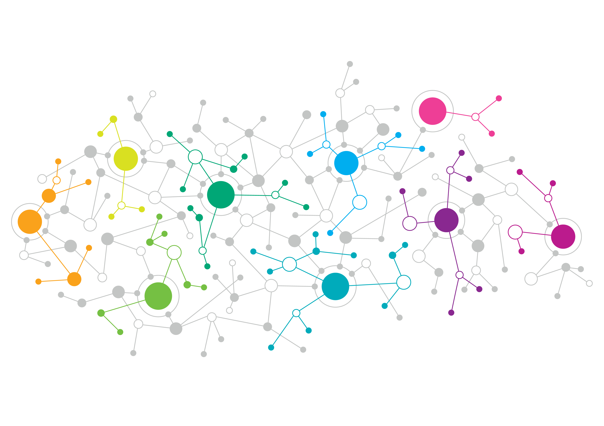

```{r, include=FALSE}
knitr::opts_chunk$set(
  results='asis', 
  echo = FALSE
)

library(glue)
library(tidyverse)

# Set this to true to have links turned into footnotes at the end of the document
PDF_EXPORT <- FALSE

# Holds all the links that were inserted for placement at the end
links <- c()

source('parsing_functions.R')

# Load csv with position info
position_data <- read_delim('positions_roberto.csv', delim=';')
position_data <- position_data[position_data$in_resume, ]
```


```{r}
# When in export mode the little dots are unaligned, so fix that. 
if(PDF_EXPORT){
  cat("
  <style>
  :root{
    --decorator-outer-offset-left: -6.5px;
  }
  </style>")
}
```


Aside
================================================================================


{width=100%}


Contact {#contact}
--------------------------------------------------------------------------------


- <i class="fa fa-envelope"></i> rolayoalarcon@gmail.com
- <i class="fa fa-github"></i> github.com/rolayoalarcon
- <i class="fa fa-bitbucket"></i> bitbucket.org/rolayo
- <i class="fa fa-phone"></i> +49 175-3435921
- <i class="fa fa-whatsapp"></i> +52 01 55-43417968


Programming Skills {#skills}
--------------------------------------------------------------------------------

- Most experience with:  
-- Python  
-- R  
-- Bash  
  
- Basic experience with:  
-- Perl  
-- HTML  
-- PHP  
-- SQL  

  
Bioinformatic Skills {#bioinformatics}  
---------------------------------------------------------------------------------
- RNA-Seq
- CHiP-Seq
- Metagenomics
- Phylogenomics
- Sequence Scanning  
  
  
Last updated on `r Sys.Date()`.

Main
================================================================================

Roberto Olayo Alarcon {#title}
--------------------------------------------------------------------------------


Most of my education has been as a student of the **National Autonomous University of Mexico** (**UNAM** for its name in Spanish). Currently, I am a seventh semester student of the Undergraduate Program in Genomic Sciences from this university. **My background consists mainly of a combination of biology, mathematics and computer science.**

Most of my research experience has been in **bioinformatics and biological data analysis**. I believe it is important to tackle one of the most important challenges of our time: Antibiotic Resistance.

Currently, **I am searching for postgraduate opportunities** to progress my career as a researcher. I would like to do research that aims to solve questions dealing with antibiotic resistance through a quantitative/computational approach.


Education {data-icon=graduation-cap data-concise=true}
--------------------------------------------------------------------------------

```{r}
print_section(position_data, 'education')
```

Publications {data-icon=book-open}
--------------------------------------------------------------------------------

```{r}
print_section(position_data, 'publications')
```

Awards and Scholarships {data-icon=award}
--------------------------------------------------------------------------------
```{r}
print_section(position_data, 'awards_scholarships')
```

::: aside
    
### LANGUAGES

**Spanish:** Native

**English:** Native

**German:** Beginner
:::


Research Experience {data-icon=chart-area}
--------------------------------------------------------------------------------
::: aside
I have mainly worked in the areas of Epigenomics, Machine Learning and Metagenomics; almost always involved in the computational aspects of the projects I participate in.
:::  

```{r}
print_section(position_data, 'research_internships')
```


Teaching Experience {data-icon=chalkboard-teacher}
--------------------------------------------------------------------------------
::: aside
I really like being involved in teaching and science communication. I believe that teachers have allowed me to reach my goals, and I would like to help others do the same.
:::

```{r}
print_section(position_data, 'teaching_experience')
```

Special Courses  {data-icon=chalkboard-teacher}
--------------------------------------------------------------------------------
```{r}
print_section(position_data, 'special_courses')
```  
<br>  
<br>  
<br>  
<br>  
<br>  
<br>  


Press (About)  {data-icon=newspaper}
--------------------------------------------------------------------------------

```{r}
print_section(position_data, 'press')
```


References  {data-icon=address-book}
--------------------------------------------------------------------------------

```{r}
print_section(position_data, 'references')
```